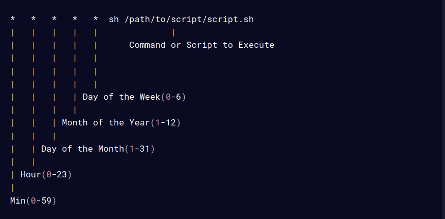

# OS LAB2 - SIMPLE ANTIVIRUS

### Folder Hierarchy
```text
lab_2
├── antivirus-cron.sh   # script for scheduled cron
├── antivirusd.sh       # script for daemon
├── directory-info.last*
├── directory-info.new*
├── .gitignore
├── .idea*
│   ├── editor.xml
│   ├── .gitignore
│   ├── misc.xml
│   ├── vcs.xml
│   └── workspace.xml
├── Makefile        # Makefile for managing targets
├── malicious_dir*
│   ├── file.bat
│   ├── file.cpp
│   ├── file.scr
│   ├── file.vbs
│   ├── hello.exe
│   └── malcious.exe
├── README.md 
├── restore.sh      # Review script
├── src_dir*
│   ├── hello.exe.hi
│   ├── hello.png
│   ├── hello.txt
│   └── main.c
└── whitelist.txt*

4 directories, 24 files
*: ignored by .gitignore
```
### Usage
#### Using Makefile
1. Antivirus Daemon
```shell
make
# or
make antivirus SRC_DIR=<path_to_src> MALICIOUS_DIR=<path_to_malicious> DELAY=<delay_in_sec>
```

2. Restore Tool
```shell
make restore
```
3. Clean Generated Files
```shell
make clean
```
### Manually
1. Antivirus Daemon
```shell
./antivirusd.sh <src_dir> <malicious_dir> <interval_in_sec>
```

2. Restore Tool
```shell
./restore.sh <src_dir> <malicious_dir>
```
### Flagged Extensions and Keywords
./antivirusd.sh
```shell
if [[ $file =~ \.(exe|bat|vbs|scr|ps1)$ ]] ||
    grep -Eiq "virus|trojan|malware|worm|ransomware" "$file"; then
    mv "$file" "$malicious_dir"
    echo "$file is malicious and it is DELETED"
fi
```


